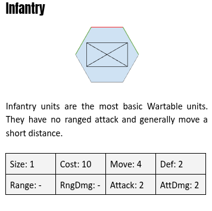
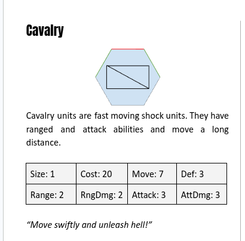
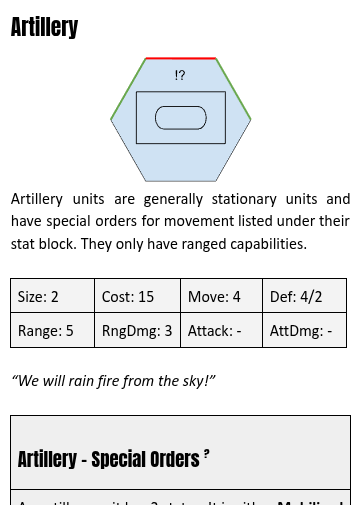

# Wartable Core Rules

Version 0.1 (draft). Authors: Mykal Anderson, Thomas Robertson.

Wartable is a framework for deterministic tabletop wargames. These core rules define how turns, orders, movement, facing and combat work. They do not define a map, an army list or a win condition; those belong to a **scenario** (see [Starter Battle](starter-battle.md) for the first one).

Rules marked **(Provisional)** were filled in so the game can be played and coded. They are open to change once playtesting starts. All of them are collected in [Section 12](#12-provisional-rules-and-open-questions).

---

## Contents

1. [Principles](#1-principles)
2. [The map](#2-the-map)
3. [Units](#3-units)
4. [Facing](#4-facing)
5. [The turn](#5-the-turn)
6. [Orders](#6-orders)
7. [Movement](#7-movement)
8. [Melee combat](#8-melee-combat)
9. [Ranged combat](#9-ranged-combat)
10. [Deployment and capacity](#10-deployment-and-capacity)
11. [Worked examples](#11-worked-examples)
12. [Provisional rules and open questions](#12-provisional-rules-and-open-questions)
13. [Creating units](#13-creating-units)
14. [Glossary](#14-glossary)
15. [Licence](#15-licence)
16. [Appendix A: combat tables](#appendix-a-combat-tables)
17. [Appendix B: orders sheet](#appendix-b-orders-sheet)

---

## 1. Principles

- **No dice.** Nothing in Wartable is random. The same position and the same orders always produce the same result.
- **Secret, simultaneous orders.** Both players write all their orders for a turn in secret, then reveal them together.
- **Alternating execution.** Orders are carried out one at a time, alternating between the players. The uncertainty in the game comes from not knowing what your opponent has ordered, or when it will happen.
- **Whole numbers only.** Wherever a rule halves a number or produces a fraction, **always round down**.
- **Best attempt.** An order is carried out as fully as it can be. It only fails completely when it cannot be attempted at all (for example, the unit has been destroyed).

## 2. The map

### 2.1 Hexes and coordinates

The map is a grid of **flat-topped hexes**. Each hex has six edges, named for the direction they face:

**N, NE, SE, S, SW, NW** (clockwise from north).

Hexes are named by **column letter** and **row number**. **A1** is the top-left hex. Columns run left to right (A, B, C … Z, then AA, AB …); rows run top to bottom.

Even-lettered columns (B, D, F …) sit half a hex lower than odd-lettered columns (A, C, E …). In practice:

| Direction | From an odd column (A, C, E …) | From an even column (B, D, F …) |
| --- | --- | --- |
| N | same column, row − 1 | same column, row − 1 |
| NE | next column, row − 1 | next column, same row |
| SE | next column, same row | next column, row + 1 |
| S | same column, row + 1 | same column, row + 1 |
| SW | previous column, same row | previous column, row + 1 |
| NW | previous column, row − 1 | previous column, same row |

Example: the hex SE of A1 is B1, and the hex NW of B1 is A1.

### 2.2 Distance

The **distance** between two hexes is the number of steps from one to the other, counting the destination but not the starting hex. Adjacent hexes are distance 1.

### 2.3 Terrain

Each scenario's map sets the terrain. Hex terrain fills a hex; **edge** terrain (rivers, bridges) runs along the edge between two hexes. Anything not marked is **open ground**, where the core rules apply exactly as written.

| Terrain | Kind | Movement | Combat |
| --- | --- | --- | --- |
| **Open** | Hex | Normal | Normal |
| **Road** | Hex (a line of hexes) | Road march (see below). A road hex is never forest: roads are cleared through it. | Normal |
| **Forest** | Hex | Costs 2 Move to enter (see below) | Defender in forest +1 Def (melee and ranged). Cavalry −1 Attack if it or its target is in forest. Artillery can't go Ready in forest. |
| **Town / hamlet** | Hex | Normal | Defender in a town or hamlet +1 Def (melee and ranged) |
| **River** | Edge | Can't be crossed, except by fording (see below) | No contact or support across it. Ranged fire is unaffected. |
| **Bridge** | Edge (on a river) | Crossed normally | Attacker attacking across a bridge −1 |

**Road march.** A Move order that **starts on a road hex** and names a **road hex** as its destination is a road march:

- The unit moves only along the road, from each road hex to the next, and may switch to another road where roads meet.
- It gets **+2 Move**.
- It ignores the safe route rule (7.2): road marching is fast but predictable, and a column marched into the enemy is ambushed as usual.
- Units can't pass through each other on the road. A blocked unit stops behind the unit in its way, so write the leading unit's order first.

**Forest.** Entering a forest hex costs **2 Move**; every other hex costs 1. A unit stops when it can't pay for its next step. A Close order's half Move is its budget, so infantry closing (2) can enter one forest hex. Every unit can always move at least one hex per order, whatever it costs.

**Fording a river.** A unit can cross a river away from a bridge only as its whole order:

- It must **start the turn next to the river** (on a hex with a river edge).
- Its order is a **Move to the hex directly across** that river edge. It moves that one hex and stops.
- Fording is always a deliberate order. The pathfinder never fords on its own; any other route across a river goes by bridge.
- Fording into a hex next to an enemy is contact as usual (7.4).

**Across a river.** Two hexes separated by a river edge (not a bridge) don't count as adjacent for **contact, support, ambush, overrun or no man's land**. Units can face each other across a river without fighting. A knockback across a river edge is blocked, so that unit is destroyed (8.3).

### 2.4 Stacking

Only one unit may occupy a hex.

## 3. Units

### 3.1 Stat block

Every unit has these stats:

| Stat | Meaning |
| --- | --- |
| **Cost** | How much of the army's capacity the unit uses (also called capacity cost). |
| **Move** | The most hexes the unit can move with one order. |
| **Def** | Defence. Resists attacks. |
| **Range** | The distances, in hexes, at which the unit can make ranged attacks, written as minimum–maximum (e.g. 3–5). A single number means a minimum of 1. "—" means no ranged attack. |
| **Attack** | Used for melee and ranged attacks. How far it beats the target's Defence decides the damage. |

A stat shown as "—" counts as **0**.

### 3.2 Strength

A unit is either at **full strength** or **half strength**.

- A full-strength unit that takes a **hit** drops to half strength. Turn its token over.
- A half-strength unit that takes a hit is **destroyed** and removed from the map.
- A half-strength unit has **−1 to every stat** except Cost (minimum 0). For Range, only the maximum drops; the minimum stays the same.

### 3.3 Unit tokens

Each unit is shown as a hex token:

- **Symbol:** a box with a military-style symbol for the unit type. Infantry is a box with a cross (X), cavalry a box with a single diagonal line, artillery a box containing a rounded dot.
- **Front edge** marked **red**, **flank edges** marked **green**, rear edges unmarked. This shows facing at a glance.
- **Order markers:** **?** means the unit has special orders; **!** means it has passive orders.
- A half-strength unit's token is turned over (or otherwise marked as damaged).

Example token art is in [docs/images](images/). The stat tables in those images are from an earlier draft (they still show Size); the tables in these rules take precedence.

### 3.4 Standard units

These are the three standard unit templates. Other units are usually variations on them.

#### Infantry

The most basic unit: no ranged attack and a short move. On its own it can only damage an enemy by attacking a flank or the rear.

| Cost | Move | Def | Range | Attack |
| --- | --- | --- | --- | --- |
| 10 | 4 | 2 | — | 2 |

*"Stand and fight!"*

#### Cavalry

Fast shock troops with both melee and a short-ranged attack.

| Cost | Move | Def | Range | Attack |
| --- | --- | --- | --- | --- |
| 20 | 7 | 3 | 2 | 3 |

*"Move swiftly and unleash hell!"*

#### Artillery

Long-ranged guns that must be set up before they can fire, and are vulnerable while moving.

| Cost | Move | Def | Range | Attack |
| --- | --- | --- | --- | --- |
| 15 | 4 | 4 Ready / 2 Mobilised | 3–5 | 3 *(ranged only, Provisional)* |

*"We will rain fire from the sky!"*

**Artillery special orders.** Artillery is always in one of two states:

| State | Def | Can move? | Can fire? |
| --- | --- | --- | --- |
| **Mobilised** | 2 | Yes | No |
| **Ready** | 4 | No (cannot turn either) | Yes |

- Artillery is **Mobilised** when deployed.
- A **Ready** order switches a Mobilised unit to Ready. A **Mobilise** order switches a Ready unit to Mobilised. Either order uses the unit's order for the turn.
- **(Provisional)** A Ready or Mobilise order may also set the unit's facing. Without this, Ready artillery could never turn.
- Artillery cannot make melee attacks (it cannot be given a Close and Attack order), and never attacks in an ambush. It can still defend in melee.
- **Dug in.** Ready artillery can't be knocked back. If it loses a melee by any margin, from any side, it is **destroyed**. Ranged attacks against it work normally (a margin of 1–2 is one hit).
- Mobilised artillery is knocked back like any other unit.

**Artillery passive order: Barrage.** At the start of every Execution Phase, before any written orders, each **Ready** artillery unit makes a ranged attack against **every** enemy unit inside its range band (3–5 hexes) and firing arc. See [5.3](#53-execution-phase).

- The barrage is in addition to the artillery's normal order for the turn, so the same gun can still Fire later in the turn.
- Units too close (1–2 hexes) are safe from the barrage, and from all artillery fire.
- The intended play: **never stop inside enemy artillery range.** Guns sit behind a friendly fighting line, covering the ground in front of it, and enemies must close quickly or go around.

## 4. Facing

Every unit faces one of its six hex edges. That edge is its **front**. The two edges either side of the front are its **flanks**. The other three edges are its **rear**.

For a unit facing N:

| Edge | Counts as |
| --- | --- |
| N | Front |
| NE, NW | Flank |
| SE, S, SW | Rear |

Facing matters in two ways:

- **Melee attacks from the side or rear** get a bonus (see [8.2](#82-position-bonus)).
- **Ranged attacks** can only target units in the shooter's **firing arc**: the 120° wedge in front of the unit, bounded by straight lines running out through its two flank edges. Hexes exactly on those lines are inside the arc. For a unit facing N, the arc is everything between the line of hexes running NE and the line running NW, including both lines.

A target's own facing does not matter for ranged attacks.

### 4.1 Setting facing

- **Deploy:** the order may name a facing. If it doesn't, the unit faces the enemy's side of the map (as set by the scenario).
- **Move:** the order may name a facing. If it doesn't, the unit ends facing the direction of its last step. A Move to the unit's own hex with a facing just turns it on the spot.
- **Close and Attack / Close and Fire:** facing is set automatically to the direction of the last step taken. **(Provisional)** If the unit doesn't move at all, it turns to face the target as closely as possible (the edge pointing most directly at it).
- **Knockback** does not change facing.

## 5. The turn

Each turn has two phases: the **Orders Phase** and the **Execution Phase**.

### 5.1 Orders Phase

Both players secretly write their orders on an orders sheet, **in the order they want them carried out**.

- A player may write any number of orders, including none.
- Each unit may receive **at most one order** per turn. A unit with no order does nothing.

When both players are finished, the sheets are revealed.

### 5.2 Initiative

Each player adds up the **Move stat of every unit given a Move order** on their own sheet. Other orders don't count. (Use half-strength stats where they apply.)

The player with the **lower total has initiative** and their first order is carried out first. Writing fewer or shorter moves wins initiative.

**Ties.** Before the game, the players agree who holds the **tie-break**. The holder wins the first tied initiative, then the tie-break passes to the other player. It keeps alternating each time it is used.

### 5.3 Execution Phase

**Step 1: passive orders.** First, all passive orders take effect (for the standard units, that is the artillery [Barrage](#artillery)). Passive fire from **both** sides happens at the same moment:

1. Work out every passive attack using the positions at the start of the phase: which targets are in range and arc, and each attack's result, including support.
2. Then apply all the hits together. A unit hit by more than one gun takes a hit from each, so a full-strength unit hit twice is destroyed.

Because everything is worked out before anything is applied, it never matters whose guns fire first, and a unit destroyed in the barrage still counts as support for that barrage.

**Step 2: written orders.** Orders are then carried out alternately: the initiative player's 1st order, the other player's 1st order, the initiative player's 2nd order, and so on. When one player runs out of orders, the other player's remaining orders are carried out back to back.

Each order is carried out **completely**, including any combat it causes, before the next order starts. Nothing happens at the end of the phase: units that are adjacent to enemies only fight when an order makes them.

If a unit is destroyed before its order comes up, that order is skipped (it still uses its place in the sequence).

> **Table tip: check no man's land.** Every contact leads to a fight, and every fight ends with one side knocked back or destroyed. So after every order, no two enemy units should ever be adjacent. If they are, a rule has been missed: wind back to the last order and check it.

## 6. Orders

| Order | Detail | Counts for initiative? |
| --- | --- | --- |
| **Deploy** | A reserve unit (or, from turn 2, a unit type to buy from the bank), a hex in your deployment zone, optional facing | No |
| **Move** | A hex or a unit, optional facing | Yes |
| **Close and Attack** | A named enemy unit | No |
| **Fire** | A named enemy unit | No |
| **Close and Fire** | A named enemy unit | No |
| **Ready / Mobilise** | Artillery only; optional facing | No |

Examples as written on an orders sheet:

| Unit | Order | Detail |
| --- | --- | --- |
| 4th Foot | Deploy | D2, facing S |
| 1st Horse | Move | E9 |
| 2nd Horse | Move | 15th Foot |
| 3rd Foot | Move | F6, facing NE |
| 4th Foot | Close and Attack | 15th Foot |
| 1st Guns | Fire | 15th Foot |
| 2nd Horse | Close and Fire | 15th Foot |

### 6.1 Deploy

Places a unit from off the map onto an empty hex in its deployment zone: either one of your reserves, or a new unit bought from the bank (section 10). **(Provisional)** If the hex is occupied, or adjacent to an enemy, when the order is carried out, the Deploy fails and the unit stays off the map.

### 6.2 Move

The unit moves toward the named hex (or the named unit's hex), up to its Move, following the movement rules in [Section 7](#7-movement). If it comes into contact with any enemy, it is **ambushed** (see [7.4](#74-contact-and-ambush)).

The named hex can be anywhere on the map, however far away. A unit ordered to a distant objective moves as far toward it as it can this turn (see [6.6](#66-when-an-order-cant-be-done-as-written)). The path is only worked out when the order is carried out, because other units will have moved by then.

### 6.3 Close and Attack

The unit moves toward the named enemy, up to **half its Move** (rounded down).

- As soon as it is adjacent to the named enemy, it stops and attacks it in melee ([Section 8](#8-melee-combat)). If it starts the order already adjacent, it attacks without moving.
- If it comes into contact with a **different** enemy first, it stops and is ambushed by that enemy instead.
- If it can't reach the target, it moves as close as it can and does nothing else.

### 6.4 Fire

The unit makes a ranged attack ([Section 9](#9-ranged-combat)) against the named enemy. If the target is out of range or outside the firing arc, nothing happens.

### 6.5 Close and Fire

The unit moves toward the named enemy, up to **half its Move** (rounded down). Before each step, and after its last step, check whether the target is within range **and** inside the firing arc (using the facing the unit has at that moment). As soon as it is, the unit stops and fires. If it comes into contact with an enemy first, it stops and is ambushed.

Artillery can never use Close and Fire (it can't fire while Mobilised or move while Ready).

### 6.6 When an order can't be done as written

Orders are carried out as fully as possible:

- A Move to a hex beyond the unit's Move goes as far as it can along the path to that hex.
- An order naming an enemy unit that has already been destroyed does nothing.
- An order for a unit that has been destroyed is skipped.

## 7. Movement

### 7.1 What blocks movement

A unit can't enter a hex that is off the map or contains any other unit, friend or enemy, and can't cross a river edge except at a bridge or by fording (2.3).

### 7.2 Choosing the path

A unit takes the **safe route** if there is one: the **cheapest** path to its destination (counting each hex's movement cost, see 2.3) that doesn't pass through any hex adjacent to an enemy (the destination itself may be next to an enemy). Only if there is no safe route does it take the plain **cheapest path** around blocking hexes, and risk contact on the way (see 7.3). On open ground, cheapest is simply shortest.

- The route is judged over the whole way to the destination, even if the unit can't get there this turn.
- For Close orders, hexes next to the **named target** don't count as unsafe: the unit is trying to get there.
- The route is worked out when the order is carried out, using the positions at that moment.
- When more than one route has the same cost, the one with fewer hexes wins; if still tied, at each step the unit takes the first available direction in clockwise order from north: **N, NE, SE, S, SW, NW**.

**(Provisional)** If the destination can't be reached at all (for example, it is occupied, or the moving unit's target is surrounded), the unit heads instead for the reachable hex closest to the destination. Ties go to the hex that is the fewest steps away for the moving unit, then to the first in reading order (lowest column, then lowest row).

When the destination is an enemy unit's hex, the unit moves toward a hex adjacent to it.

### 7.3 Stopping

A unit stops moving when it can't pay for its next step (see 2.3), reaches its destination, or **enters a hex adjacent to any enemy unit**.

Moving into a hex adjacent to an enemy always ends movement, so units can't slip past enemies. A unit that starts adjacent to an enemy can move away, but if its first step is into another hex adjacent to an enemy, it stops there.

### 7.4 Contact and ambush

**Contact** happens when a moving unit enters a hex adjacent to an enemy.

On a **Close and Attack** order, contact with the named target means the moving unit attacks it.

In every other case (any contact on a Move order, contact with an enemy other than the target on a Close order), the moving unit is **ambushed**:

- Each adjacent enemy **that can make melee attacks** attacks it in melee, one at a time, checking in clockwise order around the ambushed unit starting from its N edge. (Artillery never attacks.)
- The ambushed unit is the **defender** and has **−1 Def** in these combats.
- After each combat, check again: an enemy that is no longer adjacent (because of knockback) doesn't attack. Stop if the ambushed unit is destroyed.
- If the ambushed unit loses a combat and survives, its knockback can never put it next to another enemy (it would be destroyed instead, see [8.3](#83-resolving-melee)). So losing always ends the ambush, and an ambush never draws in enemies that weren't adjacent at the start.

**Overrun.** If a moving unit is still on the map and still next to enemies that can't make melee attacks (such as artillery), it **overruns** them: it attacks each of them in melee, one at a time, clockwise from its N edge. These are normal attacks, with the moving unit as attacker and no ambush penalty. Stop if the moving unit is repelled.

## 8. Melee combat

Melee always has one **attacker** and one **defender**.

### 8.1 Support

A unit gets **+1 support for each friendly unit adjacent to it**, from any side, including units that are themselves in contact with enemies. There is no limit. Support applies to both the attacker and the defender in melee. In **ranged** attacks (Fire, Close and Fire, Barrage) only the **target** gets support: shooters never do (see 9).

### 8.2 Position bonus

The attacker gets a bonus based on which of the defender's edges it is attacking across:

| Defender's edge | Attacker's bonus |
| --- | --- |
| Front | +0 |
| Flank | +1 |
| Rear | +3 |

Facing doesn't matter for ranged attacks.

### 8.3 Resolving melee

Melee is **one comparison**. Work out the two totals:

- Attacker: **Attack + support + position bonus**
- Defender: **Def + support** (−1 if ambushed)

The **margin** is the attacker's total minus the defender's total.

| Margin | Result |
| --- | --- |
| 0 or less (**ties go to the defender**) | **Repelled.** The attacker is knocked back. No damage. |
| 1 or 2 | **Hit.** The defender takes one hit, then is knocked back. |
| 3 or more | **Destroyed.** The defender takes two hits, which destroys any unit. |

A half-strength unit that takes any hit is destroyed (see [3.2](#32-strength)).

**Knockback.** The loser (the repelled attacker, or a defender that survives a hit) is knocked back one hex **directly away from the winner** (continuing the line from the winner through the loser). It keeps its facing. If that hex is off the map, occupied, adjacent to any enemy, or across a river edge, or the loser is Ready (dug-in) artillery, the loser can't retreat and is **destroyed**.

[Appendix A](#appendix-a-combat-tables) has every matchup worked out.

## 9. Ranged combat

A ranged attack needs the target to be within the shooter's **Range** (no closer than the minimum and no further than the maximum) and inside its **firing arc** (see [Section 4](#4-facing)). Nothing blocks line of sight on open ground.

Ranged attacks use the same single comparison as melee: the shooter's **Attack** (no support) against the target's **Def + support**. The margin decides the result:

| Margin | Result |
| --- | --- |
| 0 or less | **Miss.** Nothing happens. |
| 1 or 2 | **Hit.** The target takes one hit. |
| 3 or more | **Destroyed.** The target takes two hits. |

There is no position bonus (the target's facing doesn't matter) and no knockback from ranged attacks.

## 10. Deployment and capacity

Each scenario defines **deployment zones** (DZ) for each side and an army **capacity**.

- Units start off the map and enter with **Deploy** orders.
- A scenario may also set a **starting limit**, lower than capacity. If it doesn't, the starting limit is the whole capacity.

**Starting army.** Before the game, each player secretly chooses units whose total Cost is no more than the starting limit. These are their reserves, deployed with Deploy orders on any turn.

**The bank.** Capacity not spent on the starting army goes in the **bank**. Both players' bank totals are public; what they will buy is not.

- From turn 2, a Deploy order may name a **unit type** instead of a reserve unit, for example "Deploy | Cavalry | X3". It buys a unit of that type, pays its Cost from the bank, and deploys it in the usual way. The new unit takes the next free name (e.g. "3rd Cavalry").
- A Deploy can't spend more than the bank holds. If a Deploy that buys a unit fails (6.1), nothing is bought and nothing is paid.

## 11. Worked examples

These examples are part of the rules. Each one is also an automated test in the game software, so if a rule changes, its example must change too.

Unless stated, all units are at full strength and have no adjacent allies.

### EX-1: Initiative

North writes: Move 1st Horse (Move 7), Move 2nd Foot (Move 4), Fire 1st Guns.
South writes: Move 3rd Foot (Move 4), Close and Attack 4th Horse, Move 5th Foot (Move 4).

North's total is 7 + 4 = **11**. South's total is 4 + 4 = **8** (Close and Attack doesn't count). South has initiative.

Execution order: South 1, North 1, South 2, North 2, South 3, North 3.

### EX-2: Front attack is rebuffed

Infantry A attacks Infantry B across B's front. B has one friendly unit adjacent.

- A 2 + 0 = **2** vs B 2 + 1 = **3**. Margin −1: **repelled**.
- No damage. A is knocked back one hex directly away from B.

### EX-3: Flank attack

Infantry B is at **F6 facing N**. Infantry A is at **G6**, which is B's NE neighbour, so A is attacking B's flank.

- A 2 + 1 = **3** vs B **2**. Margin 1: a **hit**. B drops to half strength.
- Knockback: the line from G6 through F6 runs SW, so B is pushed to **E7**, still facing N.

### EX-4: Rear attack

Infantry B is at **F6 facing N**. Cavalry A is at **F7**, directly S of B, attacking B's rear.

- A 3 + 3 = **6** vs B **2**. Margin 4: B is **destroyed**.

Had B been supported by two adjacent allies, it would be 6 vs 4, margin 2: a hit, and B would be knocked back N to **F5** (or destroyed if F5 were occupied or next to another enemy).

### EX-5: Ambush

Cavalry A has a Move order to F10. Its path takes it into a hex adjacent to enemy Infantry B, so it stops there and is ambushed. B attacks A across A's front (A is facing the direction of its last step, toward B).

- B 2 + 0 = **2** vs A 3 − 1 (ambushed) = **2**. Margin 0: B is **repelled**.
- No damage. B is knocked back directly away from A.

Even ambushed, cavalry holds off infantry head-on.

### EX-6: Artillery fire

Ready Artillery A fires at Infantry B, 4 hexes away and inside A's arc.

- A **3** vs B **2**. Margin 1: a **hit**. B drops to half strength.

If B had one adjacent ally, it would be 3 vs 3: a miss.

### EX-7: Barrage

North's **1st Guns** (artillery, Ready) is at **F2 facing S**. At the start of the Execution Phase, South has **3rd Foot** (infantry) at **F5** and **4th Horse** (cavalry) at **F4**.

- 4th Horse is 2 hexes away: inside the minimum range, so it isn't fired on.
- 3rd Foot is 3 hexes away, directly ahead: inside the band and the arc, so it is fired on.
- 1st Guns Attack **3** vs 3rd Foot Def 2 + 1 support (4th Horse is adjacent) = **3**. Margin 0: a miss.

If 4th Horse had not been there, it would be 3 vs 2, margin 1: a hit, putting 3rd Foot at half strength. Either way, 1st Guns can still carry out its own written order later in the turn.

### EX-8: Safe route

South's **2nd Foot** (infantry, Move 4) is at **F9** with a Move order to **F4**. North's **1st Foot** is at **G6**.

- The plain shortest route, F8, F7, F6, F5, F4, passes F6 and F5, which are next to 1st Foot. It would stop at F6 and be ambushed.
- The safe route is F8, F7, E7, E6, E5, F4: one hex longer, but never next to an enemy. 2nd Foot takes it.
- With Move 4, it ends this turn at **E6**, safe, and carries on next turn if ordered.

### EX-9: Overrun

North's **1st Guns** (artillery, Ready, Def 4) is at **F3 facing S**, with no friendly units next to it. South's **3rd Foot** (infantry) moves and makes contact with it. Artillery can't ambush, so 3rd Foot overruns the gun.

- If 3rd Foot arrives at **F2**, it attacks across the gun's N edge, its rear: 2 + 3 = **5** vs **4**. Margin 1. The gun is dug in, so it is **destroyed**.
- If 3rd Foot arrives at **F4**, it attacks the gun's front: **2** vs **4**. Margin −2: 3rd Foot is **repelled** and knocked back to F5.

### EX-10: Road march (Two Towns map)

North's **2nd Foot** (infantry, Move 4) is at **K7**, on the road, with a Move order to **S5**, further along the same road. Both hexes are road, so this is a road march with Move 4 + 2 = **6**.

- It follows the road: L6, M7, across the bridge to N6, then O6, P5, Q5. Six steps, ending at **Q5**.
- Cross-country, it would have taken the safe route with Move 4 and could not have crossed the river except by the bridge anyway.
- Had a friendly unit been standing on N6 when this order ran, 2nd Foot would have stopped at M7.

### EX-11: Fording (Two Towns map)

North's **3rd Foot** (infantry) starts the turn at **K6**, on the river bank: the edge between K6 and L5 is river. Its order is Move to **L5**.

- It fords: it moves the one hex across the river into L5 and stops.
- An order from K6 to **M4** instead would not ford: the pathfinder never fords on its own, so 3rd Foot would head for the bridge.
- An enemy standing at **L5** would not be in contact with 3rd Foot at K6: they are across a river edge. (3rd Foot couldn't ford into L5 while it is occupied.)
- An enemy at **L4** is next to L5, so if 3rd Foot fords into L5, that is contact as usual.

### EX-12: Going round the forest (Two Towns map)

South's **1st Guns** (artillery, Mobilised, Move 4) is at **Q11** with a Move order to **S9**. No enemies are near.

- Two routes are three hexes long. Through the forest, **Q10, R9, S9** costs 2 + 2 + 1 = **5**: more than Move 4, so the guns would stop in the forest.
- Round the edge, **R10, S10, S9** costs 1 + 1 + 1 = **3**.
- The guns take the cheapest route and reach S9 this turn.

## 12. Provisional rules and open questions

These rules were filled in to make the game playable and need confirming in playtesting:

1. **Artillery Attack 3** (ranged only). Artillery originally had no Attack stat, so it could never hit with ranged fire.
2. **Ready and Mobilise orders can set facing.**
3. **A Close order that doesn't move turns the unit toward its target.**
4. **Deploying into or next to an enemy fails.**
5. **Unreachable destinations:** the unit heads for the closest reachable hex.
6. **Ambush by several enemies:** each attacks in turn, clockwise from N.
7. **Half strength and range:** only the maximum range drops (artillery becomes 3–4).
8. **Barrage strength:** firing at every target plus a normal order is deliberately strong. If it dominates, the first levers to try are artillery Cost, or a limit on barrage targets.
9. **Terrain numbers:** road march +2 Move, forest costs 2 Move and gives +1 Def, cavalry −1 in forest, towns +1 Def (not dug in), bridge attacker −1.
10. **Fording** takes a whole turn and can't be done by the pathfinder on its own.

Open design questions:

- Retreat vs rout: should badly beaten units turn their back when knocked back?
- Initiative bidding, morale, terrain and barriers.
- A larger unit roster with rock-paper-scissors balance.

## 13. Creating units

New units use the standard stat block. A unit entry has:

- **Name** and a short description of how it operates.
- **Stat table:** Cost, Move, Def, Range, Attack.
- **Flavour text** in italics.
- **Special orders**, if any: orders only this unit can use.
- **Passive orders**, if any: rules that trigger automatically at the start of the Execution Phase (see [5.3](#53-execution-phase)). They are resolved simultaneously for both sides.

## 14. Glossary

| Term | Meaning |
| --- | --- |
| Adjacent | Sharing an edge. Distance 1. |
| Ambushed | A unit that blundered into contact. It defends with −1 Def. |
| Bank | Capacity not spent on the starting army. Spent during the game to buy units with Deploy orders. |
| Barrage | Artillery's passive order: Ready guns fire at every enemy in their range band and arc at the start of the Execution Phase. |
| Bridge | A crossing over a river edge. Crossed normally; an attacker attacking across it has −1. |
| Capacity | The total Cost an army may field. |
| Contact | A moving unit entering a hex adjacent to an enemy. |
| Dug in | Ready artillery: never knocked back, destroyed if it loses a melee. |
| DZ | Deployment zone. |
| Firing arc | The 120° wedge in front of a unit, bounded by lines through its flank edges. |
| Flank | The two edges either side of a unit's front. |
| Ford | Crossing a river away from a bridge: a whole turn's one-hex Move from the bank, ending on the far side. |
| Forest | Costs 2 Move to enter. Defender +1 Def; cavalry −1 Attack; artillery can't go Ready. |
| Front | The edge a unit faces. |
| Half strength | A unit that has taken one hit. −1 to all stats. |
| Hit | One step of damage: full to half strength, or half strength to destroyed. |
| Initiative | Whose first order is carried out first. |
| Knockback | The loser of a melee retreating one hex directly away from the winner. |
| Margin | Attacker's total minus defender's total. 0 or less: repelled or miss. 1–2: one hit. 3+: destroyed. |
| No man's land | The gap that always remains between enemy units after every order. Two enemy units adjacent means a rule was missed. |
| Overrun | A moving unit attacking adjacent enemies that can't make melee attacks. |
| Passive order | A rule that triggers automatically, without being written on the orders sheet. Resolved at the start of the Execution Phase. |
| Range band | The distances between a unit's minimum and maximum range. |
| Rear | The three edges behind a unit. |
| River | Edge terrain. Can't be crossed except at a bridge or by fording. No contact or support across it. |
| Road march | A Move from a road hex to a road hex. Follows the road with +2 Move and ignores the safe route rule. |
| Safe route | The shortest path that never passes next to an enemy. Units take it whenever one exists. |
| Starting limit | The most a player may spend on units before the game. The rest of the capacity goes in the bank. |
| Support | +1 to a unit's combat total for each adjacent friendly unit. Melee: both sides. Ranged: target only. |
| Tie-break | The token deciding tied initiative. Passes to the other player each time it is used. |
| Town / hamlet | Settlement hexes. Defender +1 Def. Often scenario objectives. |

## 15. Licence

| ORC Notice | This product is licensed under the ORC License located at the Library of Congress at TX 9-307-067 and available online at various locations including [possible domain names may be inserted] and others. All warranties are disclaimed as set forth therein. |
| --- | --- |
| Attribution | This product is based on the following Licensed Material: [Title of Work], [Copyright Notice], [Author Credit Information]. If you use our Licensed Material in your own published works, please credit us as follows: [Title of This Work], [Copyright Notice], [Your Author Credit Information]. |
| Reserved Material | Reserved Material elements in this product include, but may not be limited to: [to be completed], and all elements designated as Reserved Material under the ORC License. |
| Expressly Designated Licensed Material | [To be completed.] |

## Appendix A: combat tables

Every standard matchup, worked out. Find the row for the attacker, the defender and the edge attacked, then the column for the **net modifier**:

- \+ the attacker's support (adjacent friendly units)
- − the defender's support
- \+1 if the defender is at half strength
- −1 if the attacker is at half strength
- \+1 if the defender is ambushed

Melee results: **Repelled** = attacker knocked back, no damage. **Hit** = defender takes one hit and is knocked back. **Destroyed** = defender removed. A half-strength defender that is hit is destroyed. Ready artillery is dug in, so any melee win against it destroys it.

**Infantry attacking** (Attack 2)

| Defender, edge attacked | −2 | −1 | 0 | +1 | +2 | +3 |
| --- | --- | --- | --- | --- | --- | --- |
| Infantry, front | Repelled | Repelled | Repelled | Hit | Hit | **Destroyed** |
| Infantry, flank | Repelled | Repelled | Hit | Hit | **Destroyed** | **Destroyed** |
| Infantry, rear | Hit | Hit | **Destroyed** | **Destroyed** | **Destroyed** | **Destroyed** |
| Cavalry, front | Repelled | Repelled | Repelled | Repelled | Hit | Hit |
| Cavalry, flank | Repelled | Repelled | Repelled | Hit | Hit | **Destroyed** |
| Cavalry, rear | Repelled | Hit | Hit | **Destroyed** | **Destroyed** | **Destroyed** |
| Artillery (Ready), front | Repelled | Repelled | Repelled | Repelled | Repelled | **Destroyed** |
| Artillery (Ready), flank | Repelled | Repelled | Repelled | Repelled | **Destroyed** | **Destroyed** |
| Artillery (Ready), rear | Repelled | Repelled | **Destroyed** | **Destroyed** | **Destroyed** | **Destroyed** |
| Artillery (Mobilised), front | Repelled | Repelled | Repelled | Hit | Hit | **Destroyed** |
| Artillery (Mobilised), flank | Repelled | Repelled | Hit | Hit | **Destroyed** | **Destroyed** |
| Artillery (Mobilised), rear | Hit | Hit | **Destroyed** | **Destroyed** | **Destroyed** | **Destroyed** |

**Cavalry attacking** (Attack 3)

| Defender, edge attacked | −2 | −1 | 0 | +1 | +2 | +3 |
| --- | --- | --- | --- | --- | --- | --- |
| Infantry, front | Repelled | Repelled | Hit | Hit | **Destroyed** | **Destroyed** |
| Infantry, flank | Repelled | Hit | Hit | **Destroyed** | **Destroyed** | **Destroyed** |
| Infantry, rear | Hit | **Destroyed** | **Destroyed** | **Destroyed** | **Destroyed** | **Destroyed** |
| Cavalry, front | Repelled | Repelled | Repelled | Hit | Hit | **Destroyed** |
| Cavalry, flank | Repelled | Repelled | Hit | Hit | **Destroyed** | **Destroyed** |
| Cavalry, rear | Hit | Hit | **Destroyed** | **Destroyed** | **Destroyed** | **Destroyed** |
| Artillery (Ready), front | Repelled | Repelled | Repelled | Repelled | **Destroyed** | **Destroyed** |
| Artillery (Ready), flank | Repelled | Repelled | Repelled | **Destroyed** | **Destroyed** | **Destroyed** |
| Artillery (Ready), rear | Repelled | **Destroyed** | **Destroyed** | **Destroyed** | **Destroyed** | **Destroyed** |
| Artillery (Mobilised), front | Repelled | Repelled | Hit | Hit | **Destroyed** | **Destroyed** |
| Artillery (Mobilised), flank | Repelled | Hit | Hit | **Destroyed** | **Destroyed** | **Destroyed** |
| Artillery (Mobilised), rear | Hit | **Destroyed** | **Destroyed** | **Destroyed** | **Destroyed** | **Destroyed** |

**Ranged attacks** (Cavalry or Artillery, both Attack 3; the target's facing doesn't matter; for ranged, the net modifier never includes the shooter's support)

| Target | −2 | −1 | 0 | +1 | +2 | +3 |
| --- | --- | --- | --- | --- | --- | --- |
| Infantry | Miss | Miss | Hit | Hit | **Destroyed** | **Destroyed** |
| Cavalry | Miss | Miss | Miss | Hit | Hit | **Destroyed** |
| Artillery (Ready) | Miss | Miss | Miss | Miss | Hit | Hit |
| Artillery (Mobilised) | Miss | Miss | Hit | Hit | **Destroyed** | **Destroyed** |

Artillery can't make melee attacks. Mobilised artillery can't fire. Tables like these can be generated for any custom unit from its stats.

## Appendix B: orders sheet

Player: ____________________ Turn: ____

| # | Unit | Order | Detail |
| --- | --- | --- | --- |
| 1 | | | |
| 2 | | | |
| 3 | | | |
| 4 | | | |
| 5 | | | |
| 6 | | | |
| 7 | | | |
| 8 | | | |
| 9 | | | |
| 10 | | | |
