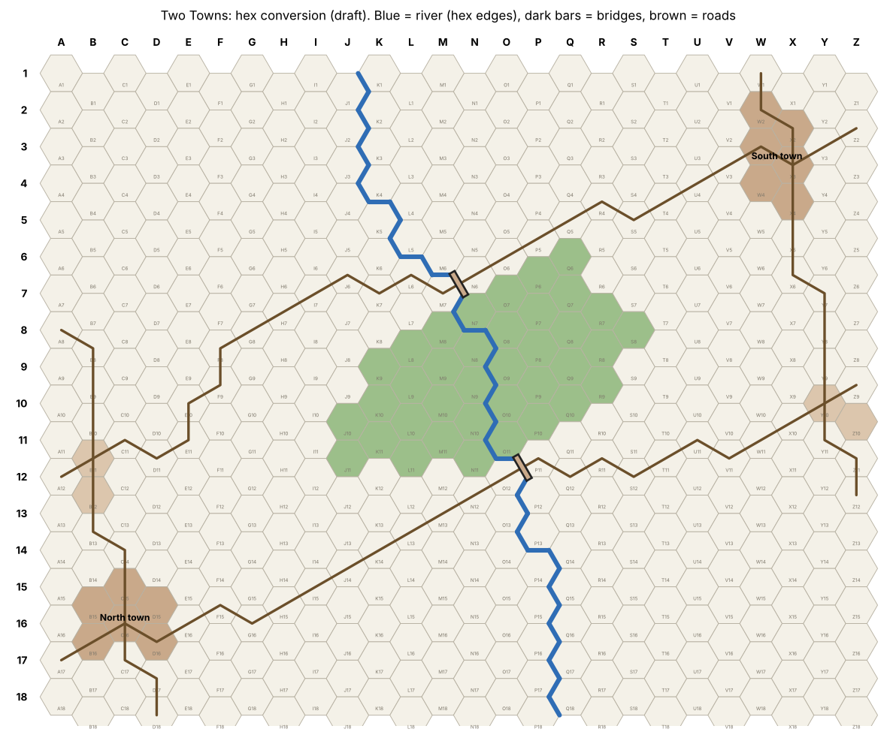

# Scenario: Two Towns

Version 0.1 (draft for playtesting). A larger battle across a river, using the [Core Rules](core-rules.md) and the terrain rules in section 2.3. Built using the method in [Building a Scenario](scenario-design.md).

## At a glance

| Setting | Value |
| --- | --- |
| Players | 2: **North** and **South** |
| Map | 26 columns × 18 rows (A1 to Z18): [data/maps/two-towns.yaml](../data/maps/two-towns.yaml) |
| Terrain | River, two bridges, roads, forest, two towns, two hamlets |
| Deployment zones | Every hex within 3 hexes of your own town (44 hexes each) |
| Default facing on deploy | Toward the enemy town: North faces NE, South faces SW |
| Capacity | 240 per side: up to **120** in the starting army, the rest in the bank |
| Units allowed | Infantry (10), Cavalry (20), Artillery (15) |
| Turn limit | 16 turns |
| Tie-break | North holds it at the start of the game |

## The map

North's town is in the bottom-left corner (B15–D16), South's in the top-right (W2–X4). A river runs from K1 to Q18 and splits the map into a North bank and a South bank. The only bridges are at **M7|N6** and **O12|P11**; anywhere else, units must ford (core rules 2.3). A forest straddles the river between the bridges. Two hamlets sit on the flanks: one near North's town (B11–B12), one near South's (Y10–Z10).

Four roads link the towns, hamlets and bridges. The map was converted from a paper map ([original](maps/two-towns-paper.jpg)).

Key distances on foot (hexes):

| | From North's town | From South's town |
| --- | --- | --- |
| Lower bridge | 12 | 12 |
| Upper bridge | 13 | 9 |
| Own hamlet | 3 | 8 |
| Enemy town | 23 | 23 |

South reaches the upper bridge first; North's hamlet is closer to home. Watch this in playtesting.

## Armies

Each player chooses a starting army costing **120 or less**. Whatever isn't spent goes in the bank, so each side has **240** in all. From turn 2, Deploy orders can buy new units from the bank (core rules, section 10). Suggested starting army (110, leaving 130 in the bank):

| Units | Cost |
| --- | --- |
| 4 Infantry | 40 |
| 2 Cavalry | 40 |
| 2 Artillery | 30 |
| **Total** | **110** |

## Objectives

Towns and hamlets are **objectives**. Each belongs to the last side to have had a unit in it. At the start, each side owns its own town; hamlets belong to no one. (On the table, mark ownership with a token.)

## Winning

1. **Capture.** At the end of a turn, if you have a unit in the enemy's town and they have none in it, the town is **captured**. If you still hold it in the same way at the end of the **next** turn, you win. (The defender gets one turn to respond, for example by buying and deploying units next to their town.)
2. **Annihilation.** A player wins immediately when the opponent has no units on the map, no reserves, and less in the bank than the cheapest unit.
3. **Turn limit.** At the end of turn 16, each side scores:
    - the Cost of its surviving units (half-strength units count half, rounded down),
    - **20** for each town it owns,
    - **10** for each hamlet it owns.

    Unspent bank doesn't score. The higher score wins. Equal scores are a draw.

## Provisional

Capacity, starting limit, turn limit, objective points and deployment zones are estimates, to be adjusted after playtesting. Playtest 1 (capacity 120, no bank) felt too thin to both hold and attack, and ended in a cavalry capture on turn 9.
